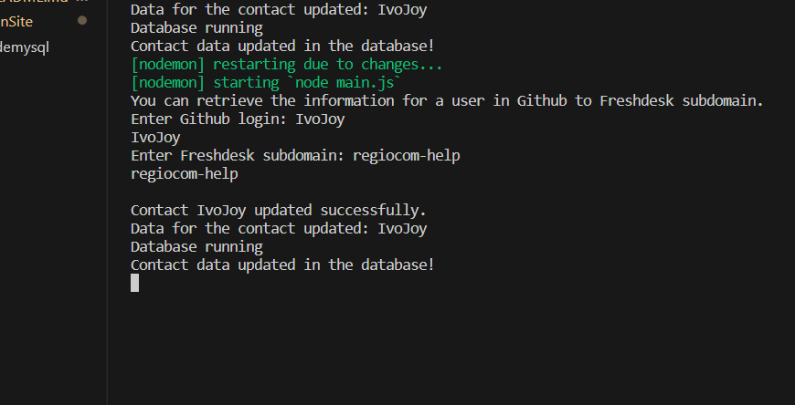

## Console Application integrated with Github and Freshdesk API
## Build in plain Node.js and using MySQL as a database
### The main funcionality is the retrieval of the user profile from Github and storing it in a Freshdesk platform
#### Libraries: axios (for requests), dotent (environment variables), mysql (for database), readline (CLI)

### Functionality
1. The user will be prompted to enter a user login from Github and Freshdesk subdomain
2. The program takes the user login and retrieves the user information throught the Github Api
3. Then, it will create user or update an existing user with the Freshdesk Api
   - Fields it transfers from Github to Freshdesk: name, location, email, login
5. At the end, it will input the information in MySQL database

